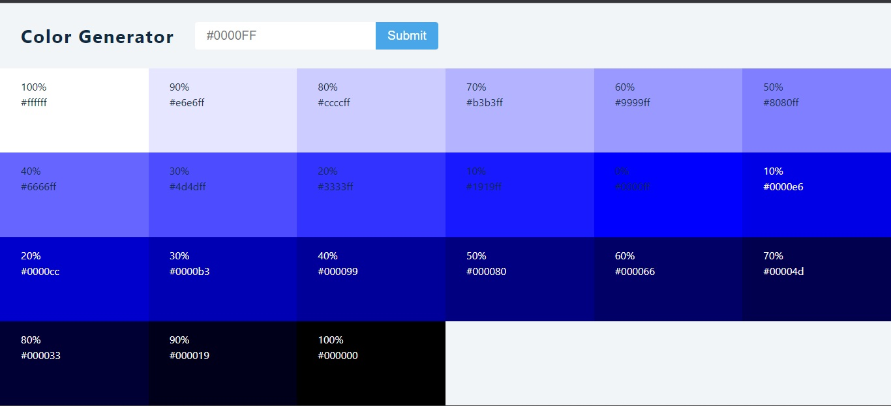

# Color Generator App with React

This is a React app that generates shades of colors based on user input using the values.js library. Users can enter a base color, and the app generates 10 shades of that color.

The app consists of two components: App.js and SingleColor.js. The App.js component contains the main logic of the app, while the SingleColor.js component renders each individual color generated.

## Demo

You can see a live demo of the Stripe navigation bar clone [here](https://pascalprojects-color-generator.netlify.app).

## Technologies Used

React
values.js
Installation and Setup
To install and run the app on your local machine, please follow these steps:

Clone the repository: git clone https://github.com/pascal-tech1/color-generator.git
Navigate to the project directory: cd color-generator-app
Install dependencies: npm install
Start the app: npm start
The app should now be running at http://localhost:3000/.

## App Structure

App.js
The App.js component renders the main layout of the app. It contains a form where users can enter a base color, and the app generates 10 shades of that color. It also renders the SingleColor component for each color generated.

The useState hook is used to manage the state of the color, error, and list variables. The color variable stores the user input, while the error variable is used to display an error message if the input is invalid. The list variable stores the list of colors generated.

The handleSubmit function is called when the user submits the form. It uses the Values library to generate 10 shades of the user input color. If the input is invalid, an error message is displayed using the setError function.

SingleColor.js
The SingleColor.js component renders each individual color generated. It takes in the rgb, weight, index, and hexColor props from the parent App.js component.

The useState hook is used to manage the state of the alert variable, which is used to display a message when the color hex code is copied to the clipboard.

The rgbToHex function is used to convert the rgb values to a hex code.

The useEffect hook is used to set a timeout for the alert message, which disappears after 3 seconds.

## Conclusion

This React app demonstrates how to use the values.js library to generate shades of colors based on user input. The app is structured into two components, App.js and SingleColor.js, and uses the useState and useEffect hooks to manage state and side effects.
